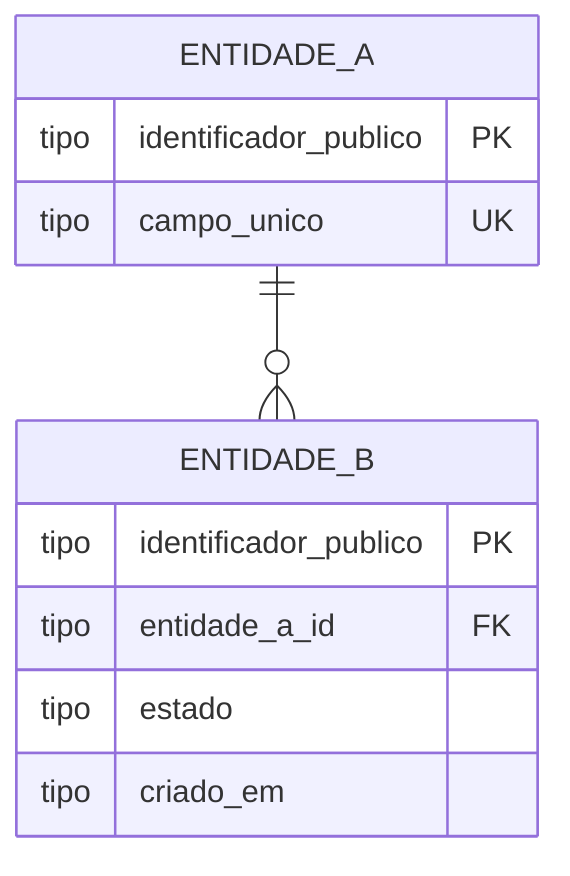

# RFC — <o desenho da sua solução, escrito como proposta>

| | |
|---|---|
| **Time** | \<nome 1\> · Luan Camargo de Souza · \<nome 3\> |
| **Data** | \<dd/mm/aaaa\> |
| **Versão** | \<1, 2, 3… — suba o número quando o desenho mudar\> |

> **Como usar este modelo** *(apague este bloco antes de entregar)*
>
> - *Cada seção abre com um bloco em itálico: o que escrever, as perguntas a responder e o tamanho
>   esperado. **Apague a orientação** e escreva no lugar dela. Não acrescente seções.*
> - *O destaque **Principal desafio** aparece **na seção onde o desafio mora** — se a parte difícil
>   é o modelo de dados, ele fica em Banco de Dados; se é concorrência ou ordem de passos, fica em
>   Fluxos. Normalmente há **um**; se houver dois de peso igual, cada um fica na sua seção.*
> - *Neste modelo o destaque aparece uma única vez, em Fluxos, como exemplo de posicionamento.*
> - *Alvo de tamanho: 2 a 4 páginas. O repositório-base (`bootcamp-base-api`, Python + FastAPI +
>   PostgreSQL + Docker) é o ponto de partida; o desenho é do seu time.*

## Contextualização

### Entendendo o problema

> *O que o sistema precisa fazer e por que isso é difícil. Responda:*
>
> - *Que operações o sistema oferece e quem as usa?*
> - *Que garantia ele precisa dar em cima do dinheiro? O que acontece se der errado — saldo
>   divergente, transação duplicada, extrato que não reconstrói o saldo, dado que some?*
> - *O que está **fora do escopo** desta entrega?*
>
> *5 a 10 linhas. Não entra aqui: solução, rota, tabela, nome de biblioteca.*

\<escreva aqui\>

### Explicando a solução de forma macro

> *A ideia em um parágrafo: quais são as peças e como elas se encaixam para dar a garantia da seção
> anterior. Um desenho de caixas ajuda, se você tiver um.*
>
> *Depois, **o que foi considerado e descartado** — uma linha por alternativa, com o preço de cada
> uma. É o que a R7 cobra: as decisões tomadas **e** as descartadas. Forma sugerida:*
>
> - *`<alternativa descartada>` — descartada porque `<o que ela custava>`. Ganharia se
>   `<cenário em que ela seria a melhor escolha>`.*
>
> *1 parágrafo + 2 a 4 alternativas. Não entra aqui: rota, tabela, passo a passo.*

\<escreva aqui\>

## Implementação

### Rotas

> *Uma linha por rota, na tabela abaixo. Regras:*
>
> - *Status de erro **explícitos** — `400`, `404`, `409`, `422`, e em que situação cada um sai. Não
>   basta escrever "erro".*
> - *Diga se a rota é **idempotente** e, se for, o que a torna idempotente (qual campo, qual
>   restrição). Repetir a mesma requisição é tema da Aula 2.*
> - *Em "Entrada", só os campos que importam para a decisão — não é o schema completo.*
>
> *Não entra aqui: código.*

| Método | Caminho | O que faz | Entrada (campos que importam) | Saídas (status e quando) |
|---|---|---|---|---|
| `POST` | `/…` | … | … | `201` …; `400` …; `409` … |
| `GET` | `/…` | … | … | `200` …; `404` … |
| … | … | … | … | … |

### Banco de Dados (Somente diagrama)

> *Só o diagrama. Entidades, chaves, relacionamentos e os campos que importam para o desafio: o que
> garante unicidade, o que guarda estado, o que registra quando aconteceu, o identificador que sai
> na resposta. **Sem prosa nesta seção** — se o principal desafio do seu desenho é o modelo de
> dados, o único texto aqui é o destaque "Principal desafio". Substitua o esqueleto abaixo pelo seu
> diagrama.*

### Fluxos

> *Para cada operação principal, dois caminhos:*
>
> - *o **caminho feliz**, em passos numerados ou diagrama de sequência;*
> - ***pelo menos um caminho de falha** — o mais provável ou o mais caro.*
>
> *Onde houver transação, concorrência ou retentativa, o passo diz o que acontece: o que é travado,
> o que é desfeito, o que o cliente recebe de volta. Não entra aqui: repetir o que a tabela de rotas
> já disse.*

**\<operação\> — caminho feliz**

1. …
2. …

**\<operação\> — falha: \<qual\>**

1. …
2. …

> ## Principal desafio
>
> *Mova este bloco para a seção onde o seu desafio está; apague daqui se não for aqui.*
>
> - **Qual é:** \<a parte do problema que resiste\>
> - **Por que é difícil:** \<o que entra em tensão, ou o cenário que quebra a solução óbvia\>
> - **Como o desenho resolve:** \<o mecanismo concreto, não a intenção\>
